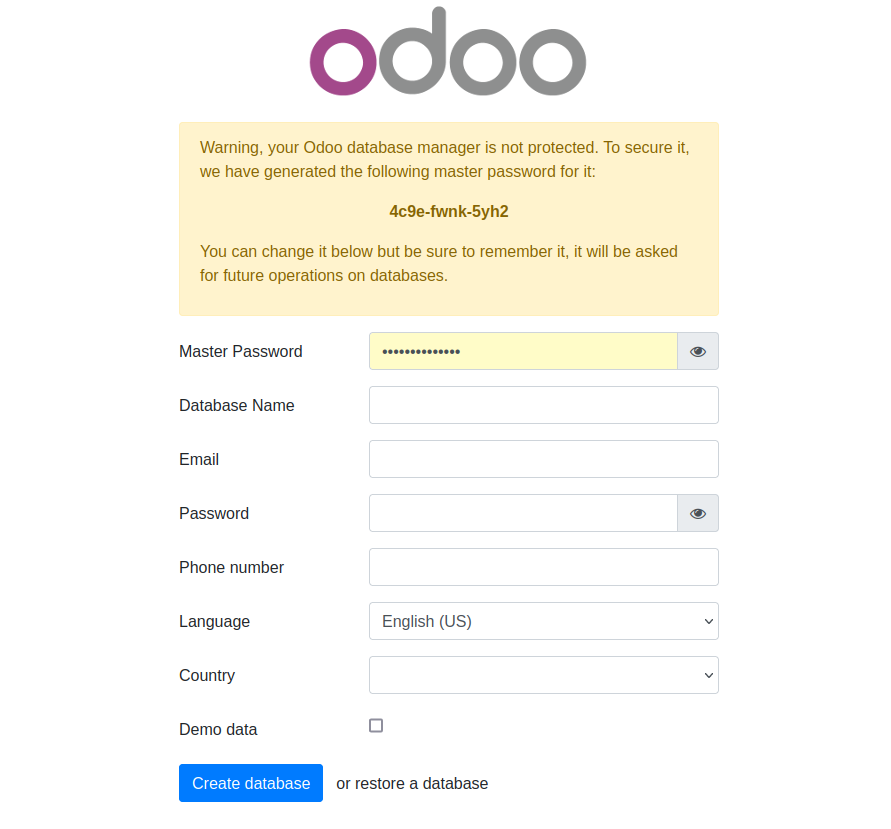

## Dependencias a otros modulos:
- base

- contacts
    - res.partner
    - res.country
    - res.country.state

- hr
    - hr.employee

## Dependencias externas:
- Geopy

## Preparación del sistema:
- Desde cero:
    1. Es conveniente crear en local una carpeta llamada Odoo_dev o [nombre de la
        empresa]_dev.
        ```shell
        mkdir odoo_dev
        ```
    2. Clonar en su interior odoodock.
        ```shell
        cd odoo_dev
        git clone https://github.com/JosemaVlc/odoodock.git
        ```
    3. Copiar ficheros .env-example a .env y .services-example a .services.
        ```shell
        cd odoodock
        cp .env-example .env
        cp .services-example .services
        ```
    4. Asignar permisos de ejecución para el usuario al fichero up.sh y create-module.sh.
        ```shell
        chmod u+x ./up.sh
        chmod u+x ./create-module.sh
        ```
    5. Arrancar los servicios.
        ```shell
        ./up.sh
        ```
        Puedes comprobar que los contenidos estan en ejecución con:
        ```shell
        docker compose ps
        ```
        tambien puedes comprobarlo con:
        ```shell
        docker ps
        ```
    6. Para comprobar que todo ha ido correctamente, acceder desde un navegador a localhost:8069, donde debe aparecer la página del selector de la base de datos.
    <p align="center">
    
    </p>

    7. Configurar los valores y crea la base de datos.

- Con Odoodock ya funcionando:
    1. Arranca los servicios
    2. Entra en el servicio web
        ```shell
        docker exec -it odoodock-web-1 bash -c \"odoo shell -d [nombre de la base de datos]\"
        ```
    3. Instala geopy:
        ```shell
        pip3 install geopy
        ```
    4. Logueate y activa modo desarrollador
    5. Recuerda tener instalado los modulos contactos y empleados, si no es así instalalos
    6. Instala el modulo incidencias

## URL del repositorios:
- [Repositorio del fork de odoodock](https://github.com/JosemaVlc/odoodock.git)
- [Repositorio del modulo](https://github.com/JosemaVlc/modulo_incidencias)
